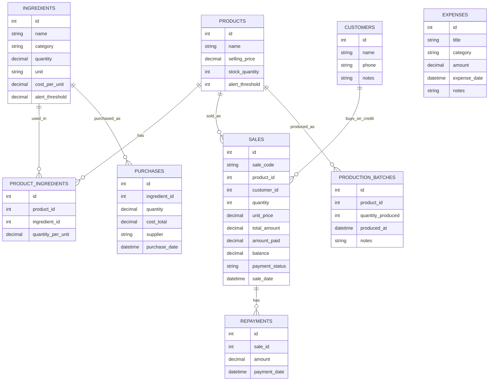

# ERD — Taem Baltina

```mermaid
erDiagram
    PRODUCTS {
      int id
      string name
      decimal selling_price
      int stock_quantity
      int alert_threshold
    }

    INGREDIENTS {
      int id
      string name
      string category
      decimal quantity
      string unit
      decimal cost_per_unit
      decimal alert_threshold
    }

    PRODUCT_INGREDIENTS {
      int id
      int product_id
      int ingredient_id
      decimal quantity_per_unit
    }

    PURCHASES {
      int id
      int ingredient_id
      decimal quantity
      decimal cost_total
      string supplier
      datetime purchase_date
    }

    CUSTOMERS {
      int id
      string name
      string phone
      string notes
    }

    SALES {
      int id
      string sale_code
      int product_id
      int customer_id
      int quantity
      decimal unit_price
      decimal total_amount
      decimal amount_paid
      decimal balance
      string payment_status
      datetime sale_date
    }

    PRODUCTION_BATCHES {
      int id
      int product_id
      int quantity_produced
      datetime produced_at
      string notes
    }

    REPAYMENTS {
      int id
      int sale_id
      decimal amount
      datetime payment_date
    }

    EXPENSES {
      int id
      string title
      string category
      decimal amount
      datetime expense_date
      string notes
    }

    PRODUCTS ||--o{ PRODUCT_INGREDIENTS : has
    INGREDIENTS ||--o{ PRODUCT_INGREDIENTS : used_in
    INGREDIENTS ||--o{ PURCHASES : purchased_as
    PRODUCTS ||--o{ SALES : sold_as
    CUSTOMERS ||--o{ SALES : buys_on_credit
    PRODUCTS ||--o{ PRODUCTION_BATCHES : produced_as
    SALES ||--o{ REPAYMENTS : has
```
