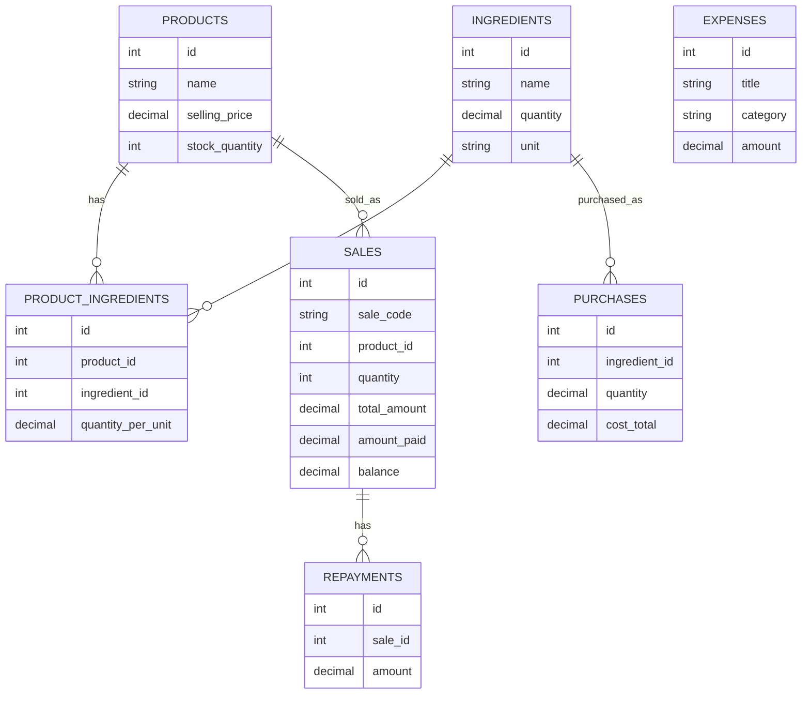

# ERD — Taem Baltina

```mermaid
erDiagram
    PRODUCTS {
      int id
      string name
      decimal selling_price
      int stock_quantity
    }

    INGREDIENTS {
      int id
      string name
      decimal quantity
      string unit
    }

    PRODUCT_INGREDIENTS {
      int id
      int product_id
      int ingredient_id
      decimal quantity_per_unit
    }

    PURCHASES {
      int id
      int ingredient_id
      decimal quantity
      decimal cost_total
    }

    SALES {
      int id
      string sale_code
      int product_id
      int quantity
      decimal total_amount
      decimal amount_paid
      decimal balance
    }

    REPAYMENTS {
      int id
      int sale_id
      decimal amount
    }

    EXPENSES {
      int id
      string title
      string category
      decimal amount
    }

    PRODUCTS ||--o{ PRODUCT_INGREDIENTS : has
    INGREDIENTS ||--o{ PRODUCT_INGREDIENTS : used_in
    INGREDIENTS ||--o{ PURCHASES : purchased_as
    PRODUCTS ||--o{ SALES : sold_as
    SALES ||--o{ REPAYMENTS : has

```